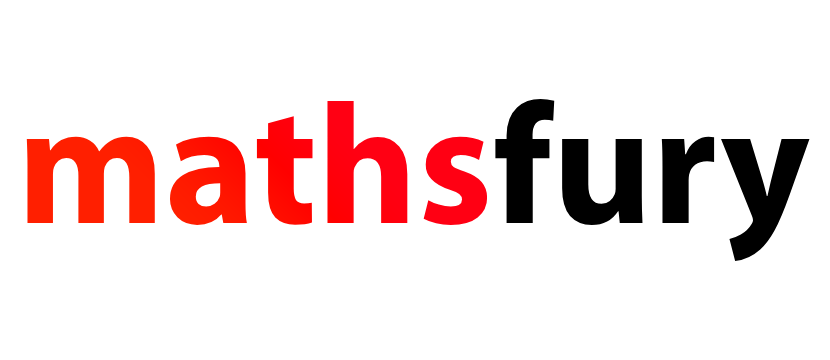

# mathsfury


### A C++ mathematics library for 3D graphics.

mathsfury is a C++ mathematics library for 3D graphics targeting PlayStation 3 and Linux (x86_64). Mathsfury provides vectors, quaternions, and matrices as well as common mathematical functions. It covers graphics programming use cases, including transformations, camera manipulation, and projection.

## Requirements

##### Core dependencies:

- [`public/tier0/platform.h`](https://gist.github.com/rs189/0a5cd6dca531814218f2e31dab0556ca) (internal platform definitions)

##### PS3 Build dependencies:

- [ps3toolchain](http://github.com/ps3dev/ps3toolchain)
- [PSL1GHT](http://github.com/ps3dev/PSL1GHT)

##### Linux build dependencies (optional, for SSE path):

- [SIMDe](https://github.com/simd-everywhere/simde)

## Interface

### CMaths
- `Sqrt(float32 f)`
- `Tan(float32 f)`
- `Cos(float32 f)`
- `Sin(float32 f)`
- `ATan2(float32 y, float32 x)`
- `ASin(float32 f)`
- `Abs(float32 a)`
- `Abs(int32 a)`
- `Min(float32 a, float32 b)`
- `Min(int32 a, int32 b)`
- `Min(uint32 a, uint32 b)`
- `Max(float32 a, float32 b)`
- `Max(int32 a, int32 b)`
- `Max(uint32 a, uint32 b)`
- `Clamp(float32 value, float32 minVal, float32 maxVal)`
- `Clamp(int32 value, int32 minVal, int32 maxVal)`
- `Clamp(uint32 value, uint32 minVal, uint32 maxVal)`
- `Normalise(const CVector3& v)`
- `Cross(const CVector3& a, const CVector3& b)`
- `Dot(const CVector3& a, const CVector3& b)`
- `Perspective(float32 fovyDeg, float32 aspect, float32 nearClip, float32 farClip)`
- `Orthographic(float32 left, float32 right, float32 bottom, float32 top, float32 nearClip, float32 farClip)`
- `LookAt(const CVector3& eye, const CVector3& target, const CVector3& up)`
- `Translate(const CMatrix4& m, const CVector3& v)`
- `Rotate(const CMatrix4& m, float32 angleDeg, const CVector3& axis)`
- `Scale(const CMatrix4& m, const CVector3& v)`
- `DirectionToEquirect(const CVector3& dir)`

### CVector2(float32 m_X, float32 m_Y)
- `operator+(const CVector2& other)`
- `operator-(const CVector2& other)`
- `operator*(const CVector2& other)`
- `operator*(float32 scalar)`
- `operator/(const CVector2& other)`
- `operator/(float32 scalar)`
- `operator+=(const CVector2& other)`
- `operator-=(const CVector2& other)`
- `operator*=(const CVector2& other)`
- `operator*=(float32 scalar)`
- `operator/=(const CVector2& other)`
- `operator/=(float32 scalar)`
- `operator==(const CVector2& other)`
- `operator!=(const CVector2& other)`
- `operator[](int32 index)`

### CVector3(float32 m_X, float32 m_Y, float32 m_Z)
- `operator+(const CVector3& other)`
- `operator-(const CVector3& other)`
- `operator*(const CVector3& other)`
- `operator*(float32 scalar)`
- `operator/(const CVector3& other)`
- `operator/(float32 scalar)`
- `operator+=(const CVector3& other)`
- `operator-=(const CVector3& other)`
- `operator*=(const CVector3& other)`
- `operator*=(float32 scalar)`
- `operator/=(const CVector3& other)`
- `operator/=(float32 scalar)`
- `operator==(const CVector3& other)`
- `operator!=(const CVector3& other)`
- `operator[](int32 index)`
- `LengthXY()`
- `Length()`
- `Distance(const CVector3& other)`
- `Distance2(const CVector3& other)`
- `Dot(const CVector3& other)`

### CVector4(float32 m_X, float32 m_Y, float32 m_Z, float32 m_W)
- `operator+(const CVector4& other)`
- `operator-(const CVector4& other)`
- `operator*(const CVector4& other)`
- `operator*(float32 scalar)`
- `operator/(const CVector4& other)`
- `operator/(float32 scalar)`
- `operator+=(const CVector4& other)`
- `operator-=(const CVector4& other)`
- `operator*=(const CVector4& other)`
- `operator*=(float32 scalar)`
- `operator/=(const CVector4& other)`
- `operator/=(float32 scalar)`
- `operator==(const CVector4& other)`
- `operator!=(const CVector4& other)`
- `operator[](int32 index)`
- `Length()`

### CQuaternion(float32 m_X, float32 m_Y, float32 m_Z, float32 m_W)
- `operator*(const CQuaternion& other)`
- `ToMatrix()`
- `ToTransformMatrix(const CVector3& position, const CVector3& scale)`
- `Normalise()`
- `Length()`
- `FromEuler(float32 pitch, float32 yaw, float32 roll)`

### CMatrix4(float32 m_Data[16])
- `operator+(const CMatrix4& other)`
- `operator-(const CMatrix4& other)`
- `operator*(const CMatrix4& other)`
- `operator+=(const CMatrix4& other)`
- `operator-=(const CMatrix4& other)`
- `operator*=(const CMatrix4& other)`
- `operator*(const CVector4& v)`
- `operator==(const CMatrix4& other)`
- `operator!=(const CMatrix4& other)`
- `ToTransformMatrix(const CVector3& position, const CVector3& scale)`

## Usage

```cpp
#include "Maths.h"

CVector3 position(1.0f, 2.0f, 3.0f);
CVector3 eye(0.0f, 0.0f, 5.0f);
CVector3 target(0.0f, 0.0f, 0.0f);
CVector3 up(0.0f, 1.0f, 0.0f);

// Transformation matrices
CMatrix4 identity;
CMatrix4 transform = CMaths::Translate(identity, position);
CMatrix4 rotated = CMaths::Rotate(transform, 45.0f, CVector3(0.0f, 1.0f, 0.0f));
CMatrix4 scaled = CMaths::Scale(identity, CVector3(2.0f, 2.0f, 2.0f));

// Camera and projection
CMatrix4 view = CMaths::LookAt(eye, target, up);
CMatrix4 projection = CMaths::Perspective(90.0f, 16.0f / 9.0f, 0.1f, 1000.0f);
CMatrix4 ortho = CMaths::Orthographic(-1.0f, 1.0f, -1.0f, 1.0f, 0.1f, 100.0f);

// Vector operations
CVector3 a(1.0f, 0.0f, 0.0f);
CVector3 b(0.0f, 1.0f, 0.0f);
CVector3 norm = CMaths::Normalise(position);
CVector3 cross = CMaths::Cross(a, b);
float32 dot = CMaths::Dot(a, b);

// Quaternion rotation
CQuaternion rotation = CQuaternion::FromEuler(0.0f, 45.0f, 0.0f);
CMatrix4 rotationTransform = rotation.ToTransformMatrix(position, CVector3(1.0f, 1.0f, 1.0f));
```

## License
mathsfury is licensed under the [MIT License](LICENSE).